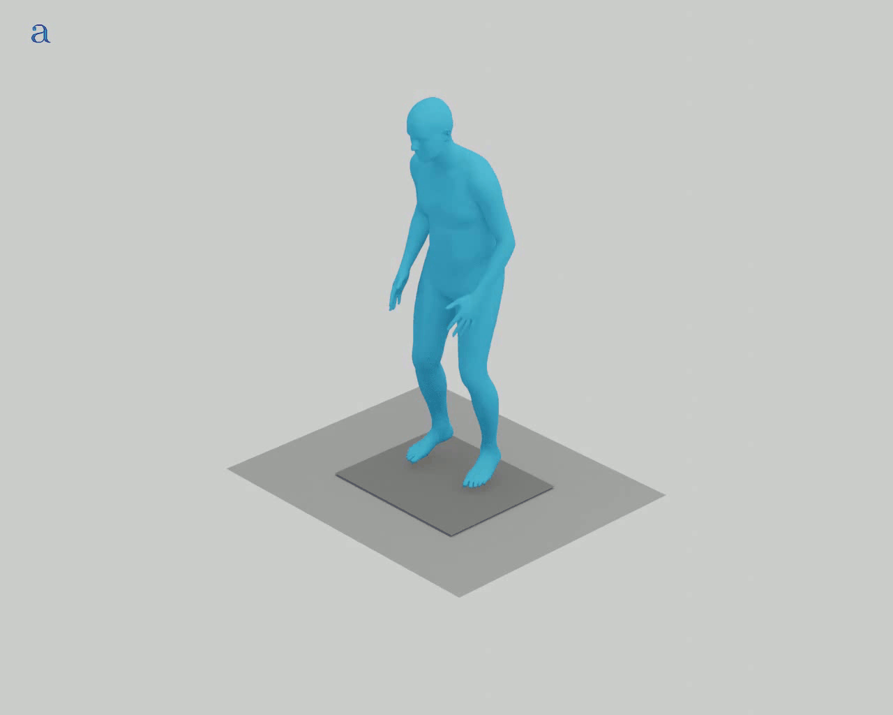
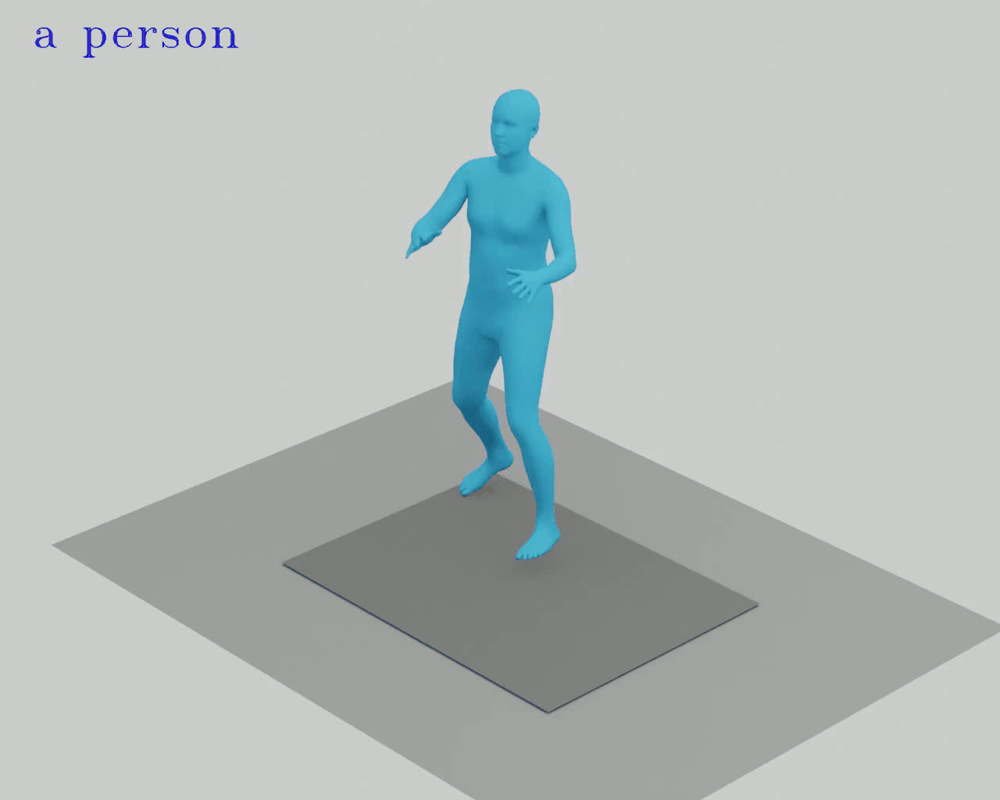
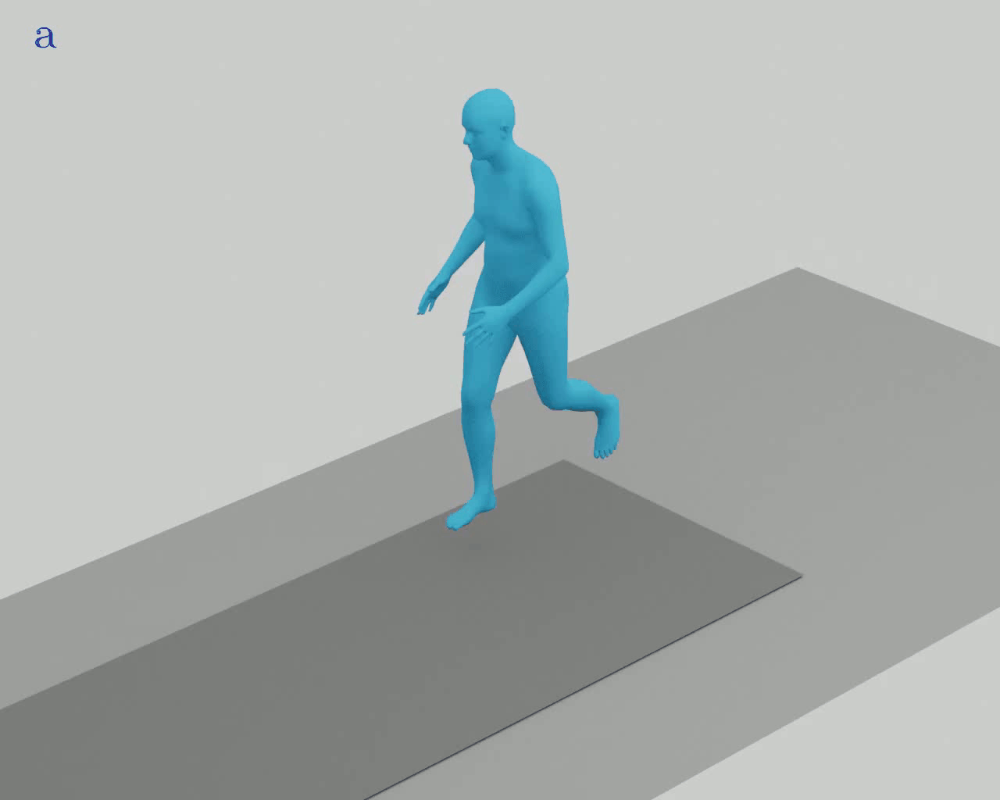
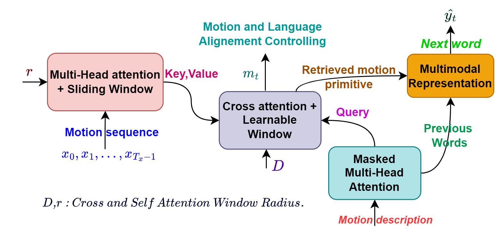
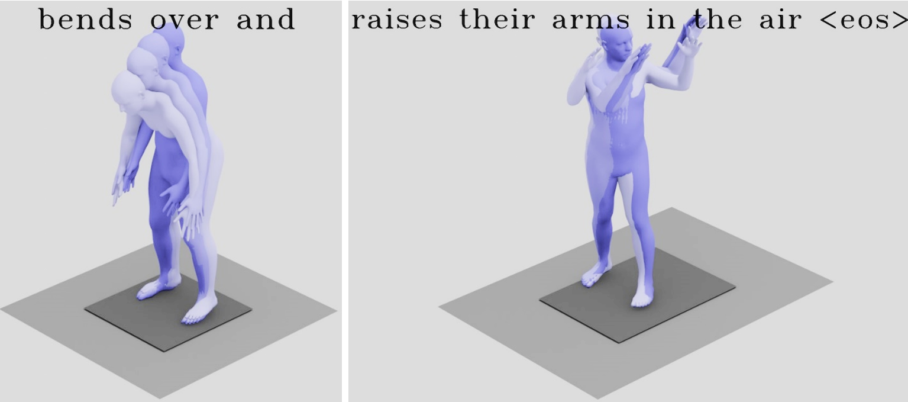
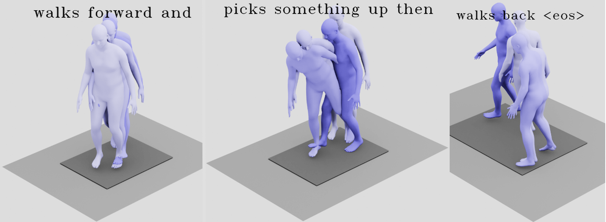
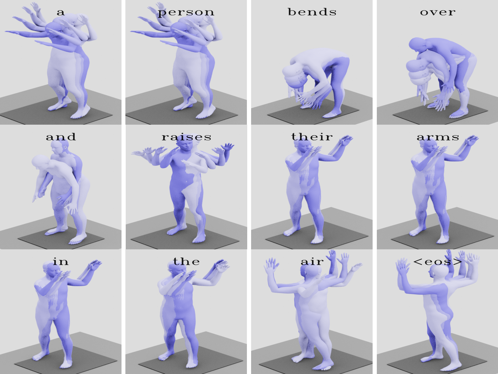
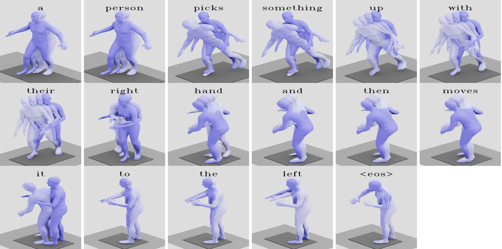

## Description

Official implementation of Synch-Transformer for synchronous motion captioning:

[ Transformer with Controlled Attention for Synchronous Captioning ]()

This work introduces a Transformer-based design to address the task of motion-to-text synchronization, as introduced in this previous project [m2t-segmentation](https://github.com/rd20karim/M2T-Segmentation).

**Synchronous captioning** aims to generate text aligned with the time evolution of 3D human motion. Implicitly, this mapping provides fine-grained action recognition and unsupervised event localization with temporal phrase grounding through unsupervised motion-language segmentation.

## Demonstration

In the following visual animations, we present the synchronized output results for some motions, mainly compositional, which include samples containing two or more actions:

  
  
  

  
  
  

  
  
  

## Architecture

Our method introduces mechanisms to **control self- and cross-attention** distributions of the Transformer, allowing interpretability and time-aligned text generation. 
We achieve this through **masking strategies** and **structuring losses** that push the model to maximize attention only on the most important frames contributing to the generation of a motion word. 
These constraints aim to **prevent undesired mixing of information** in attention maps and to provide a monotonic attention distribution across tokens. 
Thus, the cross attentions of tokens are used for **progressive text generation** in synchronization with human motion sequences.

    

## Motion Frozen in Time

* Phrase-level

    
    

* Word-level 

    
    

